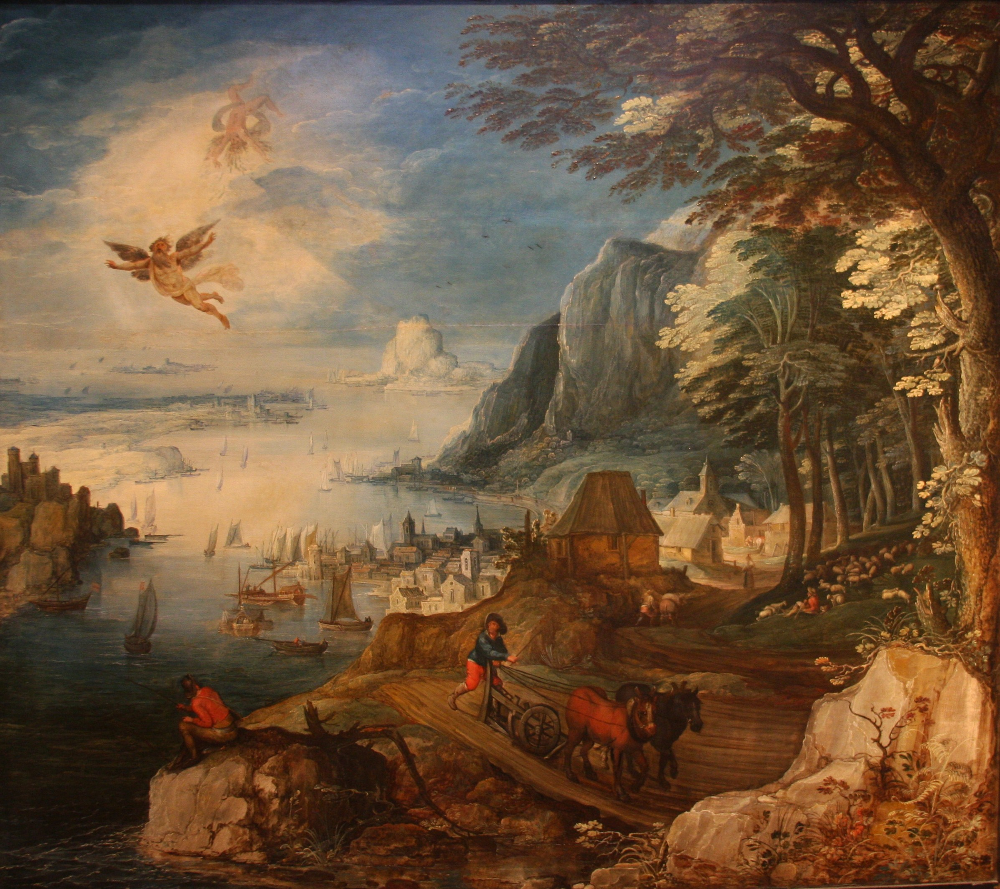

Smalltalk programming language 
<!--more-->

> *Best way to predict the future is to invent it* - Alan Kay

# 

$$ \textrm{Smalltalk} = \textrm{Language} + \textrm{Class Library} + \textrm{Development Environment} $$

Lets break this down term by term:

+ Language

+ Class Library

+ Development Enviroment

# Modern implementations

## GNU Smalltalk

## Squeak

## Pharo

## Cuis

## Amber

If you are looking for:
 - essential smalltalk experiance, without bloated IDE, use **GNU** implementation.  
 - someting closer to original experiance use **Squeak**.  
 - most developed modern succesor use **Pharo**
 - something between Cuis and Pharo





""

## 

# Basic 

# (Quasi)Factory Example

# Red Black Tree

```smalltalk {linenos=true}
Object subclass: Hello [
    greet [
            'Hello, World' displayNl
    ]
].
greeting := Hello new.
greeting greet.


Object subclass: Graph [

]
```

# What went wrong 

# Smalltalk Legacy


## OOP

## VM and JIT

## Software developement methodologies

## IDE, GUI and MVC

# Further readings and resources

Sandi Metz in *Object oriented design* 


